# Zomato's Data Platform Architecture on AWS

## Architecture Diagram

```mermaid
flowchart LR
    %% ============================================================
    %% STYLES
    %% ============================================================
    classDef source fill:#e8f4fd,stroke:#1a73e8,stroke-width:2px,color:#000
    classDef kafka fill:#f5a623,stroke:#d48806,stroke-width:2px,color:#000
    classDef processing fill:#9b59b6,stroke:#7d3c98,stroke-width:2px,color:#fff
    classDef storage fill:#27ae60,stroke:#1e8449,stroke-width:2px,color:#fff
    classDef query fill:#e74c3c,stroke:#c0392b,stroke-width:2px,color:#fff
    classDef format fill:#f39c12,stroke:#d68910,stroke-width:1px,color:#000
    classDef connector fill:#3498db,stroke:#2980b9,stroke-width:2px,color:#fff
    classDef druid fill:#2c3e50,stroke:#1a252f,stroke-width:2px,color:#fff

    %% ============================================================
    %% DATA PIPELINE 1 - BATCH ETL
    %% ============================================================
    subgraph P1["Data Pipeline-1 (Batch ETL)"]
        direction LR
        AURORA_1["🗄️ Aurora MySQL"]:::source
        SQOOP["Apache Sqoop\n(Amazon EMR)"]:::processing
        S3_RAW_1["S3\n(ORC)"]:::storage
    end

    AURORA_1 --> SQOOP
    SQOOP --> S3_RAW_1

    %% ============================================================
    %% DATA PIPELINE 2 - CDC
    %% ============================================================
    subgraph P2["Data Pipeline-2 (CDC)"]
        direction LR
        AURORA_2["🗄️ Aurora MySQL"]:::source
        subgraph DBZ["Kafka Debezium\nSource Connector (Distributed)"]
            WORKER_A["Worker-A"]
            WORKER_B["Worker-B"]
            WORKER_C["Worker-C"]
        end
    end

    AURORA_2 --> DBZ

    %% ============================================================
    %% SELF-HOSTED KAFKA CLUSTER (shared by P1, P2)
    %% ============================================================
    subgraph KAFKA1["Self-Hosted Kafka Cluster\n(Amazon EC2)"]
        direction TB
        MENU_T["menu topic"]
        PROMO_T["promo topic"]
        ORDERS_T["orders topic"]
        USERS_T["users topic"]
    end
    class KAFKA1 kafka

    S3_RAW_1 --> KAFKA1
    DBZ -- "Avro" --> KAFKA1

    %% ============================================================
    %% FLINK PROCESSING (P1 + P2)
    %% ============================================================
    FLINK_1["Amazon Flink\n(Complex Event Processing)"]:::processing

    KAFKA1 -- "Avro" --> FLINK_1

    %% Feedback loop
    FLINK_1 -. "feedback loop" .-> KAFKA1

    %% Iceberg + ORC to S3
    ICEBERG["Apache Iceberg"]:::format
    FLINK_1 --> ICEBERG
    ICEBERG --> S3_CURATED_1["S3\n(ORC + Iceberg)"]:::storage

    %% ============================================================
    %% DATA PIPELINE 3 - DYNAMODB STREAMS
    %% ============================================================
    subgraph P3["Data Pipeline-3 (DynamoDB Streams)"]
        direction LR
        DDB["🗄️ DynamoDB"]:::source
        DDB_STREAM["DynamoDB Stream\n(ECS Multi-AZ)"]:::connector
        S3_JSON["S3\n(JSON)"]:::storage
    end

    DDB --> DDB_STREAM
    DDB_STREAM -- "Real-time stream\nto S3 JSON" --> S3_JSON

    %% Spark on EMR
    EMR["Apache Spark\n(Amazon EMR)"]:::processing
    S3_JSON --> EMR
    EMR --> S3_CURATED_3["S3\n(ORC)"]:::storage

    %% ============================================================
    %% DATA PIPELINE 4 - REAL-TIME EVENTS
    %% ============================================================
    subgraph P4_SRC["Data Pipeline-4 Sources"]
        direction TB
        MICRO["🖥️ Microservices"]:::source
        WEBAPP["🌐 Web Application"]:::source
        MOBILE["📱 Mobile"]:::source
    end

    PRODUCER["Custom Producer"]:::connector
    MICRO --> PRODUCER
    WEBAPP --> PRODUCER
    MOBILE --> PRODUCER

    subgraph KAFKA2["Self-Hosted Kafka Cluster 2\n(Amazon EC2)"]
        direction TB
        MENU_T2["menu"]
        PROMO_T2["promo"]
        ORDERS_T2["orders"]
        USERS_T2["users"]
        TOPICS_T2["topics"]
    end
    class KAFKA2 kafka

    PRODUCER --> KAFKA2

    %% Flink real-time processing
    FLINK_4["Amazon Flink\n(Apache Flink)"]:::processing
    KAFKA2 --> FLINK_4

    %% Path 1: Flink → S3
    FLINK_4 --> S3_RT["S3\n(R8g Instance)"]:::storage

    %% Path 2: Flink → Kafka → Druid
    KAFKA3["Kafka\n(Amazon EC2)"]:::kafka
    FLINK_4 --> KAFKA3

    EC2_AS["Amazon EC2\nAuto-Scaling"]:::processing
    KAFKA3 --> EC2_AS

    DRUID["Apache Druid\n(Super-fast OLAP)"]:::druid
    EC2_AS --> DRUID

    %% ============================================================
    %% QUERY LAYER - TRINO
    %% ============================================================
    subgraph TRINO["Trino Query Engine\n(ECS · R8g Instance)"]
        direction TB
        ADHOC["🐰 Adhoc Clusters"]
        ETL_C["🐰 ETL Clusters"]
        REPORT["🐰 Reporting Clusters"]
    end
    class TRINO query

    %% All S3 curated outputs feed into Trino
    S3_CURATED_1 --> TRINO
    S3_CURATED_3 --> TRINO
    S3_RT --> TRINO

    %% ============================================================
    %% LEGEND
    %% ============================================================
    subgraph LEGEND["Status Key"]
        direction TB
        L_C["🟠 C = Creational"]
        L_S["🟡 S = Structural"]
        L_B["🔴 B = Behavioral"]
    end
```

## Pipeline Details

### Data Pipeline-1: Batch ETL
- **Source**: Aurora MySQL
- **Ingestion**: Apache Sqoop on Amazon EMR bulk-imports tables to S3 as ORC
- **Processing**: Data flows through self-hosted Kafka cluster, then Apache Flink performs Complex Event Processing (CEP)
- **Sink**: S3 data lake using ORC format with Apache Iceberg table format
- **Feedback**: Flink CEP results feed back into Kafka for recursive pattern detection

### Data Pipeline-2: CDC (Change Data Capture)
- **Source**: Aurora MySQL (binlog)
- **Ingestion**: Kafka Debezium source connector in distributed mode (Worker-A, B, C)
- **Serialization**: Avro format with Schema Registry
- **Topics**: `menu`, `promo`, `orders`, `users`
- **Processing**: Amazon Flink consumes Avro from Kafka, transforms, writes ORC to S3
- **Sink**: S3 with Iceberg table format

### Data Pipeline-3: DynamoDB Streams
- **Source**: DynamoDB with streams enabled
- **Ingestion**: ECS Multi-AZ service streams records to S3 as JSON (real-time micro-batches)
- **Processing**: Apache Spark on Amazon EMR reads JSON, deduplicates, builds sessions
- **Sink**: S3 in ORC format

### Data Pipeline-4: Real-time Events
- **Sources**: Microservices, Web Application, Mobile
- **Ingestion**: Custom Kafka Producer → Self-Hosted Kafka Cluster 2 (topics: menu, promo, orders, users)
- **Processing**: Amazon Flink with dual output:
  - **Path A**: Direct to S3 (ORC) for batch analytics via Trino
  - **Path B**: To intermediate Kafka cluster → EC2 Auto-Scaling consumer → Apache Druid for millisecond OLAP queries

### Query Layer: Trino
- Deployed on **ECS with R8g instances**
- **3 isolated clusters** to prevent workload interference:
  - **Adhoc Clusters**: Interactive queries from analysts
  - **ETL Clusters**: Airflow-driven transformation workloads
  - **Reporting Clusters**: Dashboard queries from Superset/Redash

### Real-time OLAP: Apache Druid
- Ingests from Kafka via EC2 Auto-Scaling consumers
- Sub-second query response on 20B events/week
- Deep storage on S3, segment caching on local SSD

## Design Pattern Annotations

The architecture uses three design pattern categories (shown in the diagram):

| Pattern | Label | Where Applied |
|---------|-------|---------------|
| **Creational** (C) | Custom Producer | Pipeline 4 producer abstracts event creation |
| **Structural** (S) | S3 Data Lake | Unified storage layer bridges all pipelines |
| **Behavioral** (B) | Kafka, Flink, Druid | Event-driven processing and reactive streaming |
